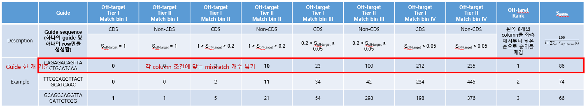

# SaCas9_off-target_activity
with https://github.com/editasmedicine/pairwise-library-screen

1. find off-target candidate by Cas-Offinder
    result form : 
        WT(guide)  chromosome  location    mis_match_seq   strand  #_of_mis_match

2-1. filter out if #_mis_match >= 2  ==> list of filterd seq by guide(21 bp)
2-2. filter out if #_mis_match == 0 doesn't exist ==> list of seq that #_mis_match == 0 doesn't exist
    result :
        WT(guide)[:21]   #_of_mis_match  #_seq  tot_seq
        AGCT...CGT  0   2   15
        AGCT...AGT  0   1   8

2. get off-target score by predict_activity_single
    input : WT[:21] mis_match_seq[:21]
    
    

####################################################################################    
1) guide RNAs design
    1-1) Initial input file: 201130_CCDS_human_current.txt, 201130_CCDS_mouse_current.txt
    1-2) Input filter
        1-2-1) ccds_id: 길이가 가장 짧은 cds에 해당하는 ccds_id만 사용
        1-2-2) ccds_status: Public만 사용
        1-2-3) match_type: Identical만 사용
    1-3) Reference genome (2200): /media/backup/ref/Ensemble_GRCh38_p13, /media/backup/ref/Ensemble_GRCm38_p6
    1-4) guide RNA 기준
        1-4-1) cds의 5-65% 구간에 cleavage site가 위치하는 guide RNA context를 genomic region에서 찾음 (cleavage site가 junction에 겹치면 제거)
        1-4-2) Cas9별로 길이 및 PAM 조건은 기존에 전달해드린 것과 같아 따로 적지 않았으나 필요하시면 이 파일에 업데이트 하겠습니다.
    1-5)  Output file
        1-5-1) Filtered input
        1-5-2) sgRNA with context sequence (location, strand, cds 내에서 cleavage site의 위치 정보 등을 포함)

2) Cas-offinder (제가 돌릴 부분이라 생략하겠습니다.)
    
3) SaCas9 off-target activity
    3-1) Initial input file directory: B206 /extdata1/JaeWoo/Project/YoungGwang_CasOffFinder/Output/FirstResult/ 
    3-2) Soff-target: [a relative link](./pairwise-library-screen-master/predict_activity_single.py) https://github.com/editasmedicine/pairwise-library-screen 의 predict_activity_single.py
    3-3) Off-target rank
        3-3-1) Tier: off-target position이 CDS (Tier I)인지 non-CDS (Tier II)인지 분류
            3-3-1-1) Input은 Cas-OFFinder 결과의 2번째 column에서 chromosome 정보 (Cas-OFFinder output file이 조금 지저분해 chromosome 정보를 가져올 때 확인이 필요할 것 같습니다)
            3-3-1-2) 5번째 column이 +면, 3번째 column의 position + 19가 cleavage site (선생님이 get_seq_near_target_index를 해주실 때의 position 방식과 같게 하려고 위치 정보를 일부 수정하는 과정입니다)
            3-3-1-3) 5번째 column이 –면, 3번째 column의 position + 10가 cleavage site (선생님이 get_seq_near_target_index를 해주실 때의 position 방식과 같게 하려고 위치 정보를 일부 수정하는 과정입니다)
            3-3-1-4) CDS reference는 1-2-1조건을 제외한 ccds file을 사용, 즉 하나의 gene에 대해서 모든 transcript) ==> make_filtered_ccds_current_file_by_all_ccds_id() [a relative link](./MakeCDSInput.py)
        3-3-2) Match bin: Soff-target을 0.05, 0.2, 1을 기준으로 분류, 즉 Soff-target = 1 (Match bin I), 1 > Soff-target  >= 0.2 (Match bin II), 0.2 > Soff-target >= 0.05 (Match bin III), Soff-target < 0.05 (Match bin IV)으로 분류
    3-4) Sguide = 100/(1+ ∑_(𝑖=1)^𝑛▒〖𝑆𝑜𝑓𝑓−𝑡𝑎𝑟𝑔𝑒𝑡(𝑖)〗)
    
    3-5) Output file
    
